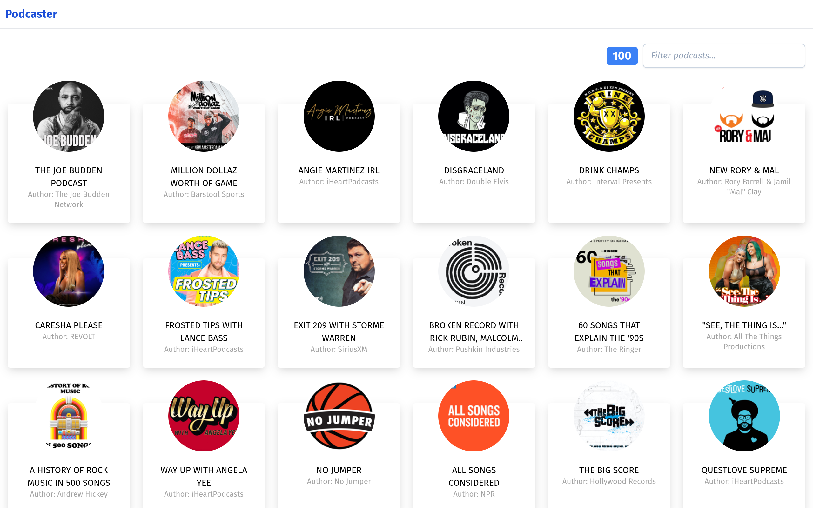
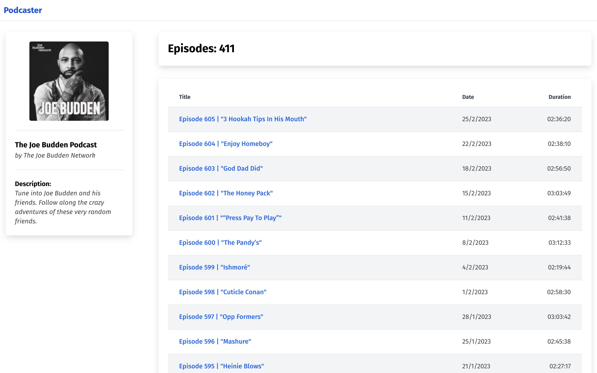
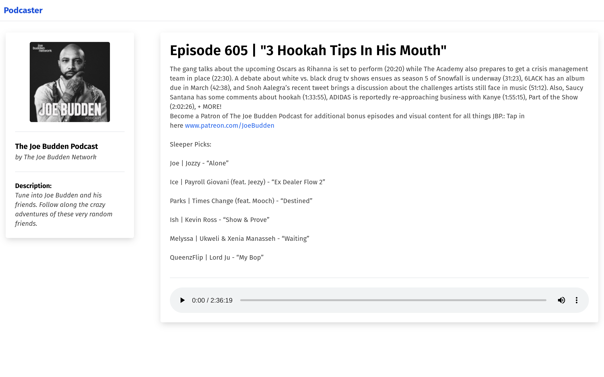
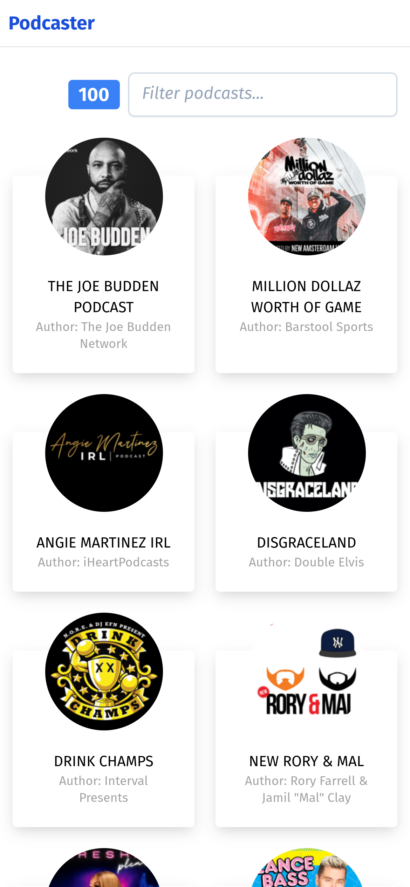
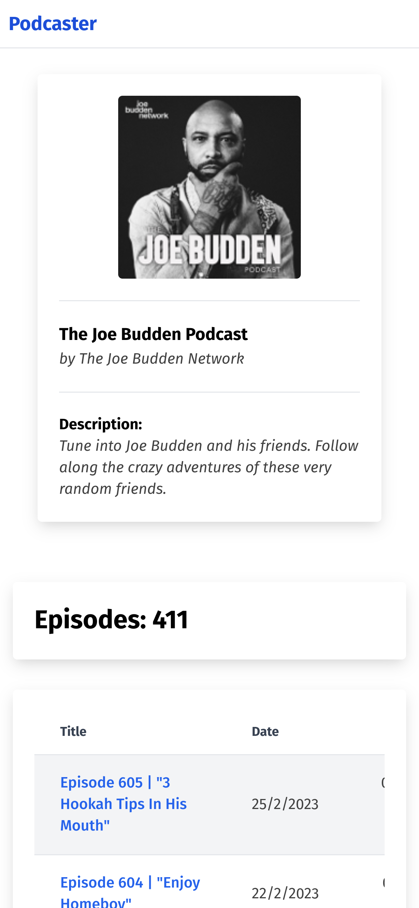
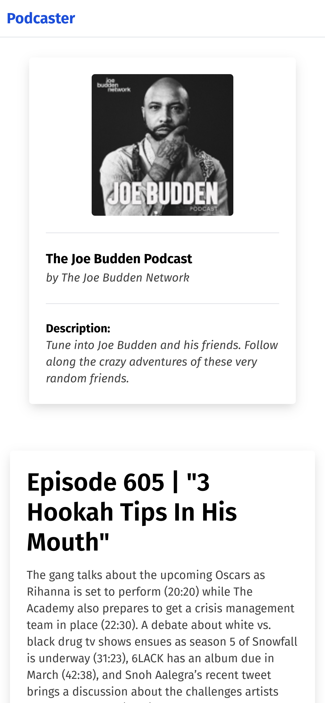

# Podcaster-Zara

<table>
<tr>
<td>
  A web app using Itunes Apple API to display the top 100 podcasts from a specific genre. It allow to navigate through the top 100 podcasts, get each podcast episodes and listen to each episode.

The requests are saved in local storage valid for one day to avoid multiple requests.

</td>
</tr>
</table>

## Get Started

To get the project running locally, follow these steps:

- Clone the repo `git clone https://github.com/joao-azevedo-toptal/podcaster-zara.git`
- Open the folder `cd podcaster-zara/` in the terminal
- Run `npm i` to install all the dependencies

### "Development"

To run the project in development run `npm run dev`

### "Production"

To run the project in production, follow these steps:

- Run `npm run build` to generate the files in `./build` folder
- Run `npm run preview` to serve the files generated in the previous step

### Tests

To run the vitest tests run `npm run test`

To run the cypress tests run `npm run cypress:open`

## Tools

Some of the tools used in this project are:

- React `18.2` for the framework
- Vite `4.1` for the bundler
- Redux `1.9` for state management
- Axios `1.3` for requests handling
- Tailwind `3.2` for styling
- Vitest `0.29` and Cypress `12.7` for tests

For a more detailed list take a look at the `package.json`

## Notes

There are two methods of getting the episodes implemented, from the podcast details endpoint (which doesn't seem to have a way to return all the episodes for the podcast and doesn't seem to return HTML for the description) and from the feed URL (which in some cases doesn't have all the info of a podcast but can't confirm this being an issue on the XML feed because only got a few incomplete that was beyond the limit that the endpoint has).

## Screenshots

### Desktop

## Mobile

